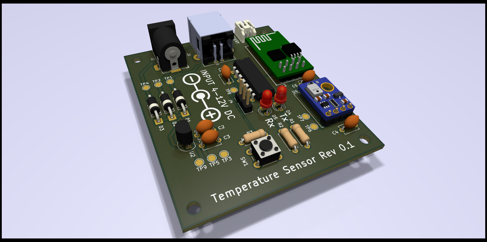

<!-- 
SPDX-FileCopyrightText: 2023-2024 Sidings Media <contact@sidingsmedia.com>
SPDX-License-Identifier: MIT
-->

# Prometheus Temperature Sensor

A WiFi enabled temperature and humidity sensor built around an ESP8266
module with a Prometheus metrics endpoint.

## Hardware



The PCB is designed to be made with entirely through hole components to
make DIY assembly easy without having to mess around with fiddly SMD
components.

### Design

#### MCU

The ESP-01 module has been used to control the sensor. This is a small
module based upon the ESP8266. 

#### Temperature / Humidity Sensor

The temperature / humidity sensor that we have used for this design is
the AHT10 although any sensor that works with 3.3V and uses I2C could
probably be made to work.

#### Power

You can power the board in 3 different ways. There is a DC jack, a USB
connector (this also doubles as a serial interface for configuration)
and finally a JST battery connector to allow make the sensor portable.
All power inputs support from 4-12V DC. Power is regulated using a
MCP1702 low dropout regulator to minimize the voltage drop from power
input to the board power supply. Each input has a 1n5817 diode on the
positive input to prevent reverse powering of devices. This does also
induce a slight voltage drop so you may require a power supply slightly
above 4V, perhaps 4.5V.

### Design Software

The schematic and board design were both drawn using
[KiCad](https://www.kicad.org/), an open source electronic design
automation suite.

## Firmware

### Build Environment

#### Toolchain and SDK

You will need to setup both the toolchain for the ESP8266 as well as the
[ESP8266 RTOS SDK](https://github.com/espressif/ESP8266_RTOS_SDK).
Espressif provide documentation for the setup of both components.

* [Toolchain Setup](https://docs.espressif.com/projects/esp8266-rtos-sdk/en/latest/get-started/index.html#setup-toolchain)
* [SDK Setup](https://docs.espressif.com/projects/esp8266-rtos-sdk/en/latest/get-started/index.html#get-esp8266-rtos-sdk)

#### Environment Variables

Two environment variables are used to tell `esptool.py` (the tool used
by the SDK to flash your firmware to the ESP8266) where to flash to and
at what speed.

* `ESPPORT` - This is the path to the device to program, e.g.
  `/dev/ttyUSB0`.
* `ESPBAUD` - Baud rate to communicate at. Should normally be set to
  `115200` for flashing.

If you encounter an error such as below when running `make flash` you
probably need to set the `ESPPORT` environment variable.

```
A fatal error occurred: Cannot find target port named 'None'.
CMake Error at run_esptool.cmake:45 (message):
  esptool.py failed
```
#### Other requirements

You will also need CMake and Make installed to compile and flash the
firmware.

### Build and flash

#### Initialize build system

First create a build directory in src and cd into it.

```
mkdir build
cd build
```

Then you can run CMake to generate the build system.

```
cmake ../src
```

#### Compile and upload

To compile the firmware run:

```
make
```

And to upload to the board run:

```
make flash
```

`make flash` will also compile the firmware before it uploads it to the
board, so you can omit running `make` separately if you like.

## Licence
This repo uses the [REUSE](https://reuse.software) standard in order to
communicate the correct licence for the file. For those unfamiliar with
the standard the licence for each file can be found in one of three
places. The licence will either be in a comment block at the top of the
file, in a `.license` file with the same name as the file, or in the
dep5 file located in the `.reuse` directory. If you are unsure of the
licencing terms please contact
[mnickson@sidingsmedia.com](mailto:mnickson@sidingsmedia.com).
All files committed to this repo must contain valid licencing
information or the pull request can not be accepted.
